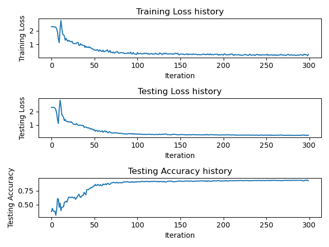

# 两层神经网络分类器

本Repo为神经网络课程作业HW1，github链接为 <https://github.com/pxyfelix/Two-layer-net>
最终模型上传到蓝奏云 <https://wwt.lanzouw.com/iEZfn02z0ppi>
解压后使用numpy中load函数即可从文件besttwolayermodel.npz中获取参数
作业具体要求详见HW1.pdf

学生：裴晓阳，学号：21210980058

按照要求作业为三个文件，分别是 model.py , parameter_search.py 和 test.py

## 1. model.py

本文件为主要模型，使用numpy构造的两层神经网络。包括读取MNIST数据集、激活函数、反向传播，loss以及梯度的计算、学习率下降策略、L2正则化、优化器SGD、保存模型以及对训练和测试的loss曲线，测试的accuracy曲线的可视化。

在初始设定的参数下训练了模型，并通过numpy中的savez函数保存在twolayermodel.npz中，训练和测试的loss曲线，测试的accuracy曲线的可视化保存在图片Loss_and_Accuracy.png当中，如下图所示：



运行下列代码即可训练模型

```
python model.py
```

### MNIST数据集

MNIST数据集可以通过网站 <http://yann.lecun.com/exdb/mnist/> 下载，包括以下4个文件

- Training set images: train-images-idx3-ubyte.gz (9.9 MB, 解压后 47 MB, 包含 60,000 个样本)
- Training set labels: train-labels-idx1-ubyte.gz (29 KB, 解压后 60 KB, 包含 60,000 个标签)
- Test set images: t10k-images-idx3-ubyte.gz (1.6 MB, 解压后 7.8 MB, 包含 10,000 个样本)
- Test set labels: t10k-labels-idx1-ubyte.gz (5KB, 解压后 10 KB, 包含 10,000 个标签)

本数据集的具体介绍可自行了解，本人通过 <https://blog.csdn.net/simple_the_best/article/details/75267863> 简单了解，对数据集的处理也参考了本篇文章

## 2. parameter_search.py

本文件主要包括了训练神经网络时对以下三个参数的查找：学习率，隐藏层大小，正则化强度。

```
learning_rate_list = [0.001, 0.005, 0.01]
hidden_dim_list = [100,500,1000]
regularization_list = [0, 0.0001, 0.001]
```

限于本人计算机的性能，只在以上列表内进行了参数的查找，扩大列表中参数的范围，可能会得到精确度更高的结果。

参数查找中每一组参数以及对应的精确度写入到文件 parameter_search.txt 当中，最佳的参数选择以及所对应模型使用numpy中的savez函数保存到besttwolayermodel.npz中。

阅读parameter_search.txt可知，

```
Best learning_rate: 0.001 Best hidden_dim: 1000 Best regularization: 0.001 Best Accuracy: 0.9704
```

运行下列代码即可进行参数查找

```
python parameter_search.py
```

## 3. test.py

在本文件中需要做到导入模型、用经过参数查找后的模型进行测试、输出分类精度三个部分。

加载在parameter_search.py中获得的besttwolayermodel.npz在测试集中输出分类精度。

运行下列代码即可进行参数查找

```
python test.py
```

可以得出准确率为：

```
Best Accuracy: 0.9701
```
